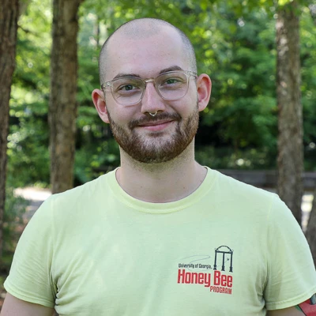
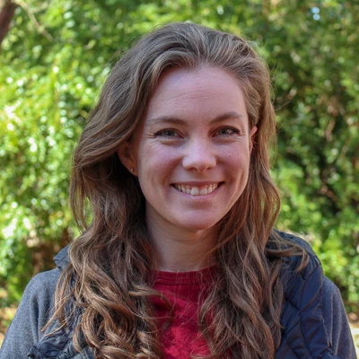
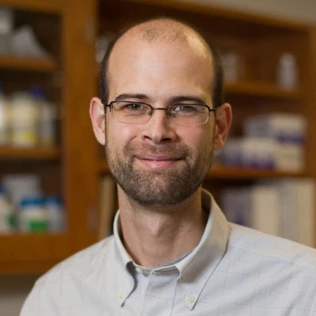
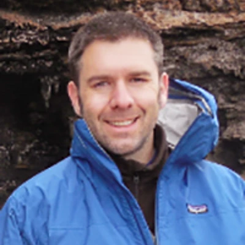
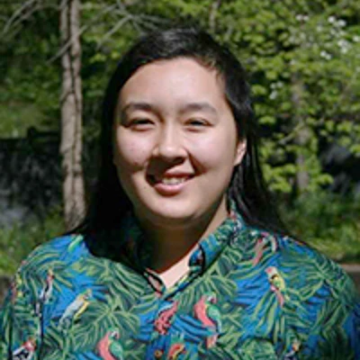
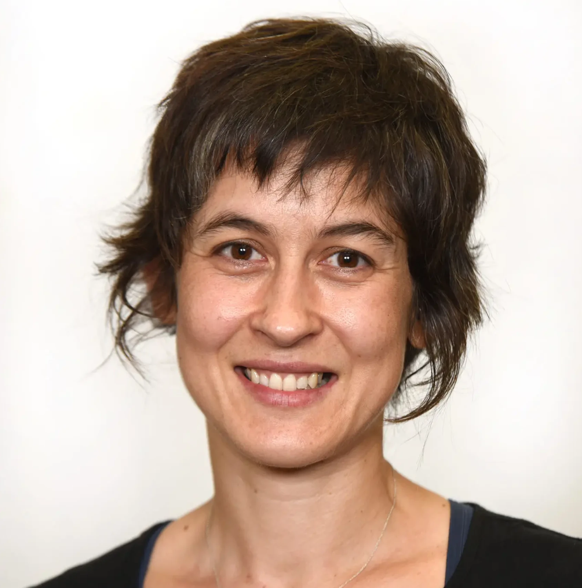
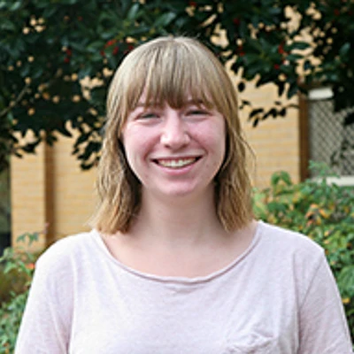
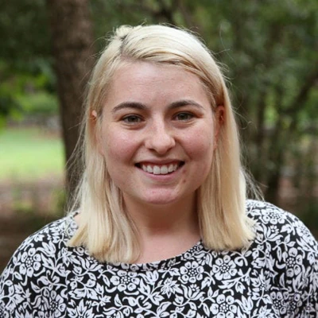

 <!-- container-fluid main-container -->

  <h2 class="lead">The UGA Center for the Ecology of Infectious Diseases <a href="http://ceid.uga.edu" target="_blank">(CEID)</a> is a research unit housed in the Odum School of Ecology at the University of Georgia. The mission of the CEID is to bring together social and natural scientists through data science, basic biology, and scientific synthesis.</h2>
  
The CEID <strong>Coronavirus Working Group</strong> was formed on January 24, 2020, three days after the Centers for Disease Control and Prevention (CDC) activated its emergency response system in reponse to the outbreak of the novel coronavirus SARS-CoV-2 in Wuhan, China. The group includes about 30 scientists with data science expertise in data manipulation and interpretation, visualization, GIS, machine learning, computational statistics, and dynamical modeling. The group's COVID-19 Portal was launched February 10, 2020.

  
<strong>Emergence of the COVID-19 Global Pandemic.</strong> On December 31, 2019, the World Health Organization was notified about the emergence of a novel coronavirus (SARS-CoV-2) in Wuhan, China. In the first weeks of January 2020, the viral disease (COVID-19) caused by SARS-CoV-2 spread across China and emerged in several other countries. Coinciding media reports about an alarming number of accumulating cases further indicated that the spread of the virus would likely become a global concern in a matter of days. On March 11, the WHO declared a global pandemic.

  

 <!-- container-fluid main-container -->

The **COVID-19 Portal** provides data-driven, information rich situation awareness about the rapidly changing conditions of the current outbreak of **COVID-19**. Activities include:

* Tracking cases, fatalities and deaths globally and across the U.S.
* Mapping the spatial spread of COVID-19 within China and globally
* Modeling transmission and extrapolation to future events
* Estimating epidemic characteristics related to transmission
* Assessing the effectiveness of public health interventions on containment
* Compiling clinical and epidemiological information to aid in the interpretation of models and understanding of events

 

 <!-- end container-fluid main-container -->

<h1>Contributors</h1>

 <!-- container-fluid main-container -->

  <h2 class="card-title name">Lewis Bartlett</h2>
  
University of Georgia

  
Center for the Ecology of Infectious Diseases

  
Postdoctoral Associate

<!--Personal personal-website btn-sm btn-primarys -->
  <a class="personal-website btn-sm btn-primary" href="https://www.ecology.uga.edu/directory/lewis-bartlett/"> more ></a>

  

  <h2 class="card-title name">Ana Bento</h2>
  
 Assistant Professor 

  
 Indiana University, Bloomington

<!--Personal personal-website btn-sm btn-primarys -->
  <a class="personal-website btn-sm btn-primary" href="https://www.anabento.io/"> more ></a>

  

  <h2 class="card-title name">Rebecca Borchering</h2>
  
Postdoctoral Associate

  
 University of Georgia

<!--Personal personal-website btn-sm btn-primarys -->
  <a class="personal-website btn-sm btn-primary" href="https://www.ecology.uga.edu/directory/rebecca-borchering/" target="_blank"> more > </a>

<!-- end of row-->

  

  <h2 class="card-title name">John Drake</h2>
  
University of Georgia

  
Center for the Ecology of Infectious Diseases

  
Director

  
Odum School of Ecology

  
Distinguished Research Professor and Associate Dean for Academic Affairs

<!--Personal personal-website btn-sm btn-primarys -->
<a class="personal-website btn-sm btn-primary" href="https://daphnia.ecology.uga.edu/drakelab/" target="_blank"> more > </a>

  

  <h2 class="card-title name">Yang Ge</h2>
  
 University of Georgia 

  
College of Public Health

  
Epidemiology & Biostatistics

  
Doctor of Philosophy (PhD) in Epidemiology & Biostatistics

<!--Personal personal-website btn-sm btn-primarys -->
  <a class="personal-website btn-sm btn-primary" href="https://publichealth.uga.edu/student/yang-ge/" target="_blank"> more > </a>

  

  <h2 class="card-title name">Andreas Handel</h2>
  
University of Georgia

  
College of Public Health

  
Epidemiology & Biostatistics, Health Informatics Institute

  
Associate Department Head and Graduate Coordinator   Associate Professor

<!--Personal personal-website btn-sm btn-primarys -->
  <a class="personal-website btn-sm btn-primary" href="https://www.andreashandel.com/" target="_blank"> more > </a>

<!-- end of row-->

  

  <h2 class="card-title name">Drew Kramer</h2>
  
University of South Florida

  
Department of Integrative Biology

  
Assistant Professor

<!--Personal personal-website btn-sm btn-primarys -->
  <a class="personal-website btn-sm btn-primary" href="https://kramera3.github.io/" target="_blank"> more > </a>

  

  <h2 class="card-title name">Culzean Kennedy</h2>
  
University of Georgia

  
MS in Comparative Biomedical Sciences

  
Scientific Writing Intern

<!--Personal personal-website btn-sm btn-primarys -->
  <a class="personal-website btn-sm btn-primary" href="http://ceid.uga.edu/blog/2020/01/22/culzean-kennedy/" target="_blank"> more > </a>

  

  <h2 class="card-title name">Brian McKay</h2>
  
University of Georgia

  
College of Public Health

  
Epidemiology & Biostatistics

  
Lecturer

<!--Personal personal-website btn-sm btn-primarys -->
  <a class="personal-website btn-sm btn-primary" href="https://publichealth.uga.edu/faculty-member/brian-k-mckay/" target="_blank"> more > </a>

<!-- end of row-->

  

  <h2 class="card-title name">Éric Marty</h2>
  
University of Georgia

  
Center for the Ecology of Infectious Diseases

  
Research Professional

<!--Personal personal-website btn-sm btn-primarys -->
  <a class="personal-website btn-sm btn-primary" href="http://www.ericmarty.com/" target="_blank"> more > </a>

  

  <h2 class="card-title name">Rachel Mercaldo</h2>
  
University of Georgia

  
College of Public Health

  
Epidemiology & Biostatistics

  
PhD Student

<!--Personal personal-website btn-sm btn-primarys -->
  <a class="personal-website btn-sm btn-primary" href="https://handelgroup.uga.edu/" target="_blank"> more > </a>

  

  <h2 class="card-title name">Paige Miller</h2>
  
University of Georgia

  
Odum School of Ecology

  
PhD Student

  <!--Personal personal-website btn-sm btn-primarys -->
  <a class="personal-website btn-sm btn-primary" href="https://www.ecology.uga.edu/directory/paige-miller/" target="_blank"> more > </a>

<!-- end of row-->

  

  <h2 class="card-title name">Tierney O'Sullivan</h2>
  
University of Georgia

  
Center for the Ecology of Infectious Diseases

  
Staff Statistician

  <!--Personal personal-website btn-sm btn-primarys -->
  <a class="personal-website btn-sm btn-primary" href="https://www.researchgate.net/profile/Tierney_Osullivan" target="_blank"> more > </a>

  

  <h2 class="card-title name">Chloe Parker</h2>
  
University of Georgia

  
Center for the Ecology of Infectious Diseases

  
Graphic Design Intern

  <!--Personal personal-website btn-sm btn-primarys -->
  <a class="personal-website btn-sm btn-primary" href="https://chloeparker.myportfolio.com/" target="_blank"> more > </a>

  

  <h2 class="card-title name">Robbie Richards</h2>
  
University of Georgia

  
Odum School of Ecology

  
PhD Student

  <!--Personal personal-website btn-sm btn-primarys -->
  <a class="personal-website btn-sm btn-primary" href="http://ezenwalab.uga.edu/people/" target="_blank"> more > </a>

<!-- end of row1-->

  

  <h2 class="card-title name">Trippe Ross</h2>
  
University of Georgia

  
Center for the Ecology of Infectious Diseases

  
Administrative Specialist & Graduate Student (MPA)

  

  <h2 class="card-title name">Kate Sabey</h2>
  
University of Georgia

  
College of Veterinary Medicine

  
IDEAS PhD Student

  <!--Personal personal-website btn-sm btn-primarys -->
  <a class="personal-website btn-sm btn-primary" href="http://ezenwalab.uga.edu/people/" target="_blank"> more > </a>

  

  <h2 class="card-title name">Liliana Salvador</h2>
  
University of Georgia

  
College of Veterinary Medicine

  
Department of Infectious Diseases & Institute of Bioinformatics

  
Assistant Professor

  <!--Personal personal-website btn-sm btn-primarys -->
  <a class="personal-website btn-sm btn-primary" href="https://vet.uga.edu/person/liliana-salvador/" target="_blank"> more > </a>

<!-- end of row-->

  

  <h2 class="card-title name">Cecilia Sánchez</h2>
  
University of Georgia

  
Center for the Ecology of Infectious Diseases

  
Postdoctoral Associate

  <!--Personal personal-website btn-sm btn-primarys -->
  <a class="personal-website btn-sm btn-primary" href="https://ceciliaasanchez.weebly.com/"> more ></a>

  

  <h2 class="card-title name">JP Schmidt</h2>
  
University of Georgia

  
Odum School of Ecology

  
Lecturer

<!--Personal personal-website btn-sm btn-primarys -->
  <a class="personal-website btn-sm btn-primary" href="https://www.ecology.uga.edu/directory/john-paul-schmidt/" target="_blank"> more > </a>

  

  <h2 class="card-title name">Patrick Stephens</h2>
  
University of Georgia

  
Odum School of Ecology

  
Associate Research Scientist

  <!--Personal personal-website btn-sm btn-primarys -->
  <a class="personal-website btn-sm btn-primary" href="https://prstephens.ecology.uga.edu/" target="_blank"> more > </a>

<!-- end of row-->

  

  <h2 class="card-title name">Chao Song</h2>
  
Michigan State University

  
Postdoctoral Associate

  <!--Personal personal-website btn-sm btn-primarys -->
  <a class="personal-website btn-sm btn-primary" href="https://songchao1986.github.io/" target="_blank"> more > </a>

  

  <h2 class="card-title name">Daniel Suh</h2>
  
University of Georgia

  
Odum School of Ecology

  
IDEAS PhD Student

  <!--Personal personal-website btn-sm btn-primarys -->
  <a class="personal-website btn-sm btn-primary" href="http://parklab.ecology.uga.edu/" target="_blank"> more > </a>

  

  <h2 class="card-title name">Benjamin Taylor</h2>
  
University of Georgia

  
Odum School of Ecology

  
Public Relations Specialist

  <!--Personal personal-website btn-sm btn-primarys -->
  <a class="personal-website btn-sm btn-primary" href="https://sasakilab.ecology.uga.edu/people/" target="_blank"> more > </a>

<!-- end of row-->

  

  <h2 class="card-title name">David Vasquez</h2>
  
University of Georgia

  
Odum School of Ecology

  
IDEAS PhD Student

  <!--Personal personal-website btn-sm btn-primarys -->
<a class="personal-website btn-sm btn-primary" href="https://davidvasquezjr.wixsite.com/diseaseecology" target="_blank"> more > </a>

  

  <h2 class="card-title name">Joy Vaz</h2>
  
University of Georgia

  
Odum School of Ecology

  
IDEAS PhD Student

  <!--Personal personal-website btn-sm btn-primarys -->
  <a class="personal-website btn-sm btn-primary" href="https://daphnia.ecology.uga.edu/drakelab/" target="_blank"> more > </a>

  

  <h2 class="card-title name">Jessica Wenclawiak</h2>

University of Georgia

Center for the Ecology of Infectious Diseases

Scientific Writing Intern

<!--Personal personal-website btn-sm btn-primarys -->
<a class="personal-website btn-sm btn-primary" href="https://daphnia.ecology.uga.edu/drakelab/" target="_blank"> more > </a>

<!-- end of row-->

  

  <h2 class="card-title name">Anna Willoughby</h2>
  
University of Georgia

  
Odum School of Ecology

  
IDEAS PhD Student

<!--Personal personal-website btn-sm btn-primarys -->
<a class="personal-website btn-sm btn-primary" href="https://daphnia.ecology.uga.edu/drakelab/" target="_blank"> more > </a>

  

  <h2 class="card-title name">Cali Wilson</h2>
  
University of Georgia

  
Odum School of Ecology

  
IDEAS PhD Student

  <!--Personal personal-website btn-sm btn-primarys -->
<a class="personal-website btn-sm btn-primary" href="http://halllab.ecology.uga.edu/" target="_blank"> more > </a>

<!-- end of row-->

<!--End of People -->

