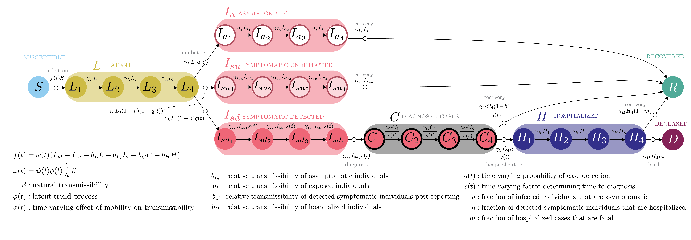

<p id="disclaimer"></p>

## COVID‑19 forecasts for the US by State {.tabset .tabset-fade}
<strong>`r format(Sys.time(), '%B %d, %Y')`</strong>

### Overview

Here we present a model for the transmission of SARS-CoV-2 from March 2020 through the present in all states of the United States of America. 
The model builds on previous work, where we developed the model for Georgia, USA only.

This model takes into account the effect of human mobility on transmission (i.e., social distancing), as well as hard to quantify human behaviors and environemntal factors, and is calibrated to the history of incident case and death reports. 

For each state, the model forecasts reported cases, deaths, and total number of infections (including unreported infections) four weeks into the future,
under three scenarios: 

1. **Increasing social distancing.** Increasing social distancing reduces human movements from the current level to 30% of normal, which is the reduction observed in New York City that enabled transmission to decline there.
2. **Maintain social distancing (status quo).** Maintaining social distancing at the level last observed in the Unacast mobility data.
3. **Return to normal.** Ending social distancing increases human movements from the current level to 100% of normal. 

{insert overview figure and text}

changing mobility has effetc fo changing transmission rates... we could change other things....
text about latent trend.


### Scenarios & Forecasts

#### Scenarios

1. **Increasing social distancing.** Increasing social distancing reduces human movements from the current level to 30% of normal, which is the reduction observed in New York City that enabled transmission to decline there.
2. **Maintain social distancing (status quo).** Maintaining social distancing at the level last observed in the Unacast mobility data (varies by state).
3. **Return to normal.** Ending social distancing increases human movements from the current level to 100% of normal. 

#### Forecasts

```{r echo=FALSE, out.extra='id="nCov-tracker" scrolling="no" width="100%"'}
knitr::include_url("https://shiny.ovpr.uga.edu/csf/")
```
<!-- <script>iFrameResize({ log: false }, '#nCov-tracker')</script> -->

### Model Details

To date, the primary intervention has been the adoption of social distancing behaviors and improved hygiene.
We measure social distancing using aggregated, anonymized locations recorded by location-based mobile phone apps, colected by <a href="https://www.unacast.com/covid19/social-distancing-scoreboard" target="_blank">Unacast</a>. We summarize the effectiveness of social distancing behaviors as the average deviation from baseline, a statistic ranging from 0% (complete cessation of movements) to 100% (no difference from baseline).

<!--  -->

{ width=350px }

Key features of this model include:

1. Stochastic transmission process with a realistic level of **random variation**.
2. Realistic distributions of **presymptomatic and symptomatic periods**.
3. Different **transmission rates for asymptomatic, presymptomatic, and symptomatic individuals**.
4. Time varying **rates of case detection, isolation, and case notification**.
5. Accounting for the effect on transmission of **human mobility** (i.e., **social distancing**), as measured by data.
6. A "latent" process that captures the effect of **environmental factors and other behaviors** that can reduce transmission but are difficult to quantify with data (e.g., hand washing or face masks).

This model comprises susceptible, pre-symptomatic, asymptomatic, symptomatic, diagnosed, hospitalized, deceased, and recovered persons. 
The following compartments are included:  

* $\boldsymbol{S}$ - Uninfected and *susceptible* individuals. Susceptible individuals can become infected by individuals in the $E$, $I_a$, $I_{su}$, $I_{sd}$, $C$, and $H$ stages. Rates of transmission from these stages can be adjusted individually.
* $\boldsymbol{L}$ - Individuals with *latent* infections who do not yet show symptoms. Those individuals can be infectious. At the end of the $L$ stage, a fraction moves into the $I_a$ stage, another fraction moves into the $I_{su}$ stage, and the remainder into the $I_{sd}$ stage.
* $\boldsymbol{I_a}$ - Individuals who are infected and *asymptomatic*. Those individuals are likely infectious, but the model allows to adjust this.
* $\boldsymbol{I_{su}}$ - Individuals who are infected and *symptomatic*, but are *undetected*. Those individuals are likely infectious. Individuals in this compartment never get diagnosed, and are assumed to recover.
* $\boldsymbol{I_{sd}}$ - Individuals who are infected and *symptomatic*, and are *detected*. Those individuals are likely infectious. Individuals in this compartment will get diagnosed and move to $C$.
* $\boldsymbol{C}$ - Individuals who have been diagnosed as *cases*. Those individuals are likely isolated and not infectious, but the model allows to adjust this. A fraction of individuals in the $C$ stage will naturally recover, without the need for hospitalization. The remainder moves into the $H$ stage.
* $\boldsymbol{H}$ - Individuals who have been *hospitalized*. Those individuals are likely isolated and not infectious, but the model allows to adjust this. A fraction of individuals in the $H$ stage will recover, the remainder will die.
* $\boldsymbol{R}$ - *Recovered/removed* individuals. Those individuals have recovered and are immune. 
* $\boldsymbol{D}$ - Individuals who *died* from the infection. 

To allow more realistic distributions of movement through compartments, several of these compartments are internally split into multiple stages using the *linear chain trick*.[^2]

* $\boldsymbol{L}$ - 4 compartments
* $\boldsymbol{I_a}$ - 4 compartments 
* $\boldsymbol{I_{su}}$ - 4 compartments
* $\boldsymbol{I_{sd}}$ - 4 compartments
* $\boldsymbol{C}$ - 4 compartments
* $\boldsymbol{H}$ - 4 compartments

The flow diagram for this model shown below.



#### Interventions

The following interventions are implemented:

* Social distancing is assumed to reduce all transmission rates by some factor. This is provided as a covariate based on mobility data.
* Improving detection, which is assumed to increase sigmoidally up to a maximum value.
* Improving detection, which is assumed to increase the fraction of symptomatic individuals that move into the $I_{sd}$ compartment and will eventually be diagnosed. It is assumed to increase sigmoidally up to a maximum value.

#### Parameterization

This model was initially parameterized using clinical outcome reports from the epidemic in Hubei province, China and further calibrated with information about COVID-19 elsewhere in China and the United States.

The model is created for a population of 10.6 million people, approximately the population size of Georgia, and simulated forward from March 1.
Transmissibility of the virus is assumed to be proportional to the level of human movement.

Key parameters estimated using maximum likelihood by iterated filtering (MIF)[^3] include baseline transmissibility ($\beta_0$), maximum ascertainment (i.e. maximum fraction of cases detected), fraction of known cases that are hospitalized, fatality rate among hospitalized cases, and observation errors. 
Auxiliary parameters estimated using MIF include the intensity of the parameter random walk and dispersion parameters for observables.

For full model details, see J.M. Drake, A. Handel, E.B. O’Dea, A.T. Tredennick. <a href="stochastic-fitting-georgia-suplement.html" target="_blank">A stochastic model for the transmission of SARS-CoV-2 in Georgia, USA</a>

All model code is available in the <a href='https://github.com/CEIDatUGA/COVID-stochastic-fitting' target='_blank'>public GitHub repository</a>


[^1]:[Rong et al. 2020](https://wwwnc.cdc.gov/eid/article/26/5/20-0198_article?deliveryName=DM20712), [Du et al. 2020](https://www.medrxiv.org/content/10.1101/2020.02.19.20025452v3)

[^2]:[Hurtado & Kirosingh 2019](https://link.springer.com/article/10.1007/s00285-019-01412-w)

[^3]:[Ionides et al. 2006](https://www.pnas.org/content/103/49/18438)

## Supplemental Information

<div class="container-frames">

<p>Model details:<br>
  <a href="forecast-suplement.html" target="_blank">
  J.M. Drake, A. Handel, A.T. Tredennick. A stochastic model for the state-level transmission of SARS-CoV-2 in the USA</a> (html)
</p>

<!-- Preprint: [download]() -->

GitHub repositories:

<p>
  <a href="https://github.com/CEIDatUGA/COVID-stochastic-fitting" target="_blank">
    
    This repository
    </a> contains code for running the model and generating some overview plots.
</p>

<p>
  <a href="https://github.com/CEIDatUGA/COVID-shiny-forecast" target="_blank">
    
    This repository
  </a> contains code used to generate the visualization dashboard on the "Scenarios & Forecasts" tab.
</p>

</div>