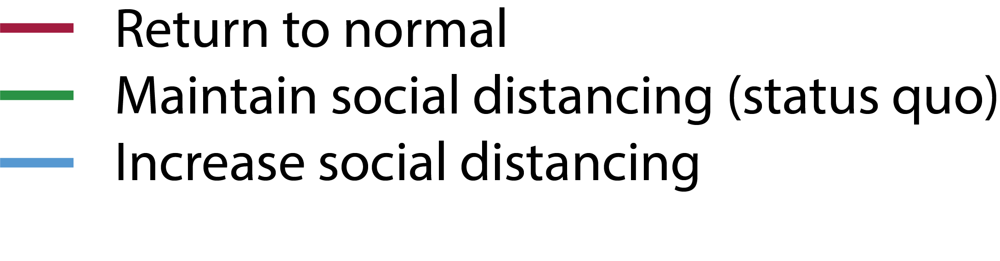

 <!-- container-fluid main-container -->

  <!--<h1 class="display-3"></h1>-->
  <h2 class="lead">The COVID-19 Portal is a resource for researchers, policymakers, and the public that provides tracking, modeling, and analysis of the ongoing COVID&#8209;19 pandemic.</h2>
  <h2 class="lead">The&nbsp;UGA&nbsp;Center&nbsp;for&nbsp;the&nbsp;Ecology&nbsp;of Infectious&nbsp;Diseases&nbsp; [(CEID)](https://www.ceid.uga.edu)<strong> Coronavirus&nbsp;Working&nbsp;Group</strong>&nbsp;&nbsp;
  <a class="btn btn-primary btn-sm" href="#news" role="button">News &amp; Updates</a></h2> 
  <small>Information for UGA students and staff: <a href="https://www.uga.edu/coronavirus" target="_blank">www.uga.edu/coronavirus</a></small>
  

<!-- Dashboard -->
<!-- 
<h2>Nowcasts: Estimates of current outbreak size</h2>
 -->

<h2>Stochastic model for Georgia</h2>

<!-- 
 -->

<!-- US NOWCAST -->
<!-- 
 -->
<!-- 
  -->
<!-- <iframe class="embed-responsive-item" src="USnowcast_plot.html" allowtransparency="true"></iframe> -->
<!-- 

 -->
<!-- END US NOWCAST -->

<!-- GA NOWCAST -->
<!-- 
  -->
<!-- 
  -->
<!-- <iframe class="embed-responsive-item" src="GAnowcast_plot.html" allowtransparency="true"></iframe> -->
<!-- 

  -->
<!-- END GA NOWCAST -->

<!-- 
 -->
<!-- 
 -->
<!--  -->
<!-- 
  -->
<!-- 
 -->
<!-- <a class="btn btn-primary btn-sm" href="nowcast.html" role="button">Nowcasts for all states &#8594;</a> -->
<!-- 
  -->

<!-- GA MODEL -->

 

<iframe class="embed-responsive-item" src="stochastic-fitting-georgia-summaryplot.html" allowtransparency="true"></iframe>

 
<!-- GA MODEL -->

<!-- GA MODEL legend + button -->

To better understand the potential range of epidemic outcomes in the state of Georgia, we developed a model incorporating regionally specific conditions and calibrated to reported cases and deaths.   We explore three social distancing scenarios ranging from increased social distancing to a complete return to normal.  The model uses social distancing data and also captures hard-to-measure human behaviors such as mask wearing.
 
<a class="btn btn-primary btn-sm" href="stochastic-GA.html" role="button">Stochastic Model for Georgia &#8594;</a>

 
<!-- end GA MODEL legend + button -->

 <!-- end row -->

 <!-- end jumbotron -->

 <!-- container-fluid main-container -->

### The science of reopening: Can testing students work?
by John M. Drake  
August 17, 2020  
Forbes.com

As universities across the nation reopen, CEID Director John Drake discusses testing programs instituted by various universities, as well as models developped at Yale and elsewhere to assess the effectiveness of these programs. Read the complete column at <a href="https://www.forbes.com/sites/johndrake/2020/08/17/the-science-of-campus-reopening-can-testing-students-work/#6c08a3502c7a" target="_blank">Forbes.com</a>.

### Five approaches to the suppression of SARS&#8209;CoV&#8209;2 without intensive social distancing
August 3, 2020  

CEID researchers have [modeled](suppression.html) the effectiveness of generalized and targeted non-pharmaceutical interventions in controling the spread of SARS&#8209;CoV&#8209;2. Generalized policies include limiting large gatherings, wearing face masks, hand washing, enhanced sick leave policies, limiting large gatherings, and other behavioral changes not involving intensive social distancing or shelter-in-place orders. Targeted methods include active case finding, contact tracing, immunity certification, and quarantine. Because non-pharmaceutical policies have disrupted local and state economies, understanding the effectiveness of less disruptive interventions to control SARS&#8209;CoV&#8209;2 is increasingly important. Researchers developed two modeling frameworks to study the effectiveness of targeted strategies in combination with generalized interventions. Results indicated that the four targeted interventions studied are effective. However, generalized methods such as wearing a face mask and reduced densities were determined to significantly improve the effectiveness of targeted interventions.

See [covid19.uga.edu/supression](suppression.html) for complete details and a link to the preprint.

### Surge in Deaths Associated with COVID-19
by John M. Drake  
July 18, 2020  
Forbes.com

COVID-19 deaths have now begun to surge following the earlier surge in case reports. John Drake discusses the ten-day average lag between case reporting and deaths and what it means for predicting daily deaths in the near future. Using the **lagged Case Fatality Rate** (deaths today over cases reported ten days ago), the number of of deaths over the next ten days can be estimated from daily case reports over the **previous** ten days. For the US, Drake predicts new deaths will hover around 1000 per day, ±500. Read the complete column at <a href="https://www.forbes.com/sites/johndrake/2020/07/18/surge-in-deaths-associated-with-covid-19/#5e6cb1dd79d0" target="_blank">Forbes.com</a>.

### Four Reasons Why Coronavirus Cases Are Increasing But Deaths Aren’t—Yet
by John M. Drake  
July 8, 2020  
Forbes.com

John Drake discusses the discrepancy between numbers of COVID-19 cases and deaths in the current resurgence of COVID-19. Drake explores four possible explanations: time lag, improved treatment, increased testing, and changing age distribution. Read the complete column at <a href="https://www.forbes.com/sites/johndrake/2020/07/08/four-theories-about-why-americas-second-covid-wave-isnt-quite-as-deadly-as-the-first-yet/" target="_blank">Forbes.com</a>.

### John Drake joins Forbes.com as a contributor 

July 7, 2020  

CEID director John Drake has <a href="https://www.forbes.com/sites/johndrake/2020/07/07/why-ecologists-study-infectious-diseases-and-what-we-can-learn-about-public-health-by-studying-nature/" target="_blank">joined Forbes.com as a contributor</a>. His column will address general infectious disease ecology and epidemiology, as well as COVID-19. Read his introductory column: 
<a href="https://www.forbes.com/sites/johndrake/2020/07/07/why-ecologists-study-infectious-diseases-and-what-we-can-learn-about-public-health-by-studying-nature/" target="_blank">Why Ecologists Study Infectious Diseases And What We Can Learn About Public Health By Studying Nature</a>, published July 7.

### Op-ed in The Hill by CEID Director John Drake 

**America needs a national center for infectious disease intelligence**  
by John M. Drake  
June 21, 2020  

In an opinion piece published in The Hill, CEID Director John Drake made the case that the time is now to establish a national center for infectious disease intelligence to monitor trends and provide real-time interpretation of outbreak data through modeling, biostatistics, and data science. 

Read the complete opinion at <a href="https://thehill.com/opinion/healthcare/503793-america-needs-a-national-center-for-infectious-disease-intelligence" target="_blank">TheHill.com</a>.

### John Drake on Debriefing the Briefing with Major Garrett

May 7, 2020

CEID Director John Drake discusses how COVID-19 modeling informs public policy and mitigation efforts on Debriefing the Briefing with CBS News Washington Correspondent Major Garrett. 

Listen the podcast <a href="https://tinyurl.com/yc7m85ax" target="_blank">here</a>.

### John Drake feature article on FiveThirtyEight

**Why One Expert Is Still Making COVID-19 Models, Despite The Uncertainty**  
by John M. Drake  
April 17, 2020

Read the full article on [FiveThirtyEight.com](https://fivethirtyeight.com/features/why-one-expert-is-still-making-covid-19-models-despite-the-uncertainty/).

### New Tracker for Cases, Deaths and Hospitalizations

The <a href="https://www.ceid.uga.edu" target="_blank">Center for the Ecology of Infectious Diseases (CEID)</a> and the <a href="https://publichealth.uga.edu" target="_blank">College of Public Health (CPH)</a> at UGA have created a [new interactive tracker](tracker.html) that allows users to track the spread of COVID-19 both in the US and worldwide. The tracker allows users to explore cases, hospitalizations, deaths and number of tests for every US state, as well as cases and deaths worldwide. Users can adjust the plots by choosing total or daily numbers, absolute or normalized values, and calendar date versus date since a certain number of cases occurred. The data comes from the Covid Tracking Project and the Johns Hopkins University Center for Systems Science and Engineering.

### Op-ed by CEID Director John Drake

**Dr. John Drake urges swift, decisive action to curb spread of COVID-19.**

In an op-ed in the *Atlanta Journal-Constitution*, CEID Director Dr. John Drake has called for immediate and decisive intervention to slow the spread of COVID-19.  Based on a study of government intervention in China following the initial outbreak of COVID-19 in Wuhan, CEID researchers found a very strong correlation (90%) between how early a major intervention was imposed in a province and the ultimate severity of the outbreak there. The results show that early action yields critical gains, with every delay of 3.8 days leading to a tenfold increase in cases. 

<a href="https://www.ajc.com/news/opinion/opinion-now-the-time-act-coronavirus/AwELZ1Fm9GMZVJsW6rsHJL/" target="_blank">Opinion: Now’s the time to act on coronavirus.</a> Guest column. *Atlanta Journal-Constitution,* March 13, 2020

<!--NEWS ITEMS-->

<!-- <a href="https://www.ceid.uga.edu/support/" target='_blank'>Support CEID</a> -->

### Latest Updates

<!--NEWS ITEM-->

<!-- 
 -->
<!-- 
 -->
<!-- 
 -->
<!-- #### John Drake article on FiveThirtyEight -->
<!-- 
 -->
<!-- 
 -->
<!-- <small class="card-subtitle mb-2 text-muted">April 17, 2020</small>  -->
<!-- Feature by John Drake on FiveThirtyEight: "Why One Expert Is Still Making COVID-19 Models, Despite The Uncertainty." -->
<!-- 
 -->
<!-- 
 -->
<!-- <a href="https://fivethirtyeight.com/features/why-one-expert-is-still-making-covid-19-models-despite-the-uncertainty/" target="_blank">READ at FiveThirtyEight.com &rarr;</a> -->

<!-- 
 -->
<!-- 
 -->
<!-- 
 -->

<!--NEWS ITEM-->

#### Tracking US county-level COVID-19 cases and deaths

<small class="card-subtitle mb-2 text-muted">June 11, 2020</small> 
CEID's [COVID-19 Tracker](tracker.html) has been updated to include cases and deaths at the county level for each US state. [http://covid19.uga.edu/stochastic-GA](stochastic-GA.html).

[READ MORE &rarr;](news.html#news-tracker-county)

<!--NEWS ITEM-->

#### Behavioral stochastic model for Georgia

<small class="card-subtitle mb-2 text-muted">June 2, 2020</small> 
CEID's updated stochastic model for the COVID-19 outbreak in Georgia now accounts for human actions that are difficult to quantify with data (e.g., wearing of face masks), in addition to human movement quantified through cell phone data and other sources. The new model fits reported cases, deaths, movement data, and a temporal trend in baseline transmission capturing other human behaviors. The model projects cases, hospitalizations and deaths six weeks out under three social distancing scenarios. [http://covid19.uga.edu/stochastic-GA](stochastic-GA.html).

[READ MORE &rarr;](news.html#news-georgia-stochastic-spline)

<!--NEWS ITEM-->

#### Nowcast of outbreak size

<small class="card-subtitle mb-2 text-muted">March 27, 2020</small> 
The [Nowcast](nowcast.html) of the COVID-19 outbreak size by US state has launched on the COVID-19 Portal. The Nowcast is an estimate of the total number of unreported cases by state. Nowcasts are estimated for the 50 states and for the US as a whole, and are calculated from COVID-19 case reports and fatalities. [http://covid19.uga.edu/nowcast](nowcast.html)

[READ MORE &rarr;](news.html#news-nowcast)

<!--NEWS ITEM-->

#### Stochastic model for Georgia

<small class="card-subtitle mb-2 text-muted">March 15, 2020</small> 
The COVID-19 Portal now includes a stochastic model for the COVID-19 outbreak in the state of Georgia. [http://covid19.uga.edu/stochastic-GA](stochastic-GA.html).

<!-- 
 -->
<!-- [READ MORE &rarr;](news.html#news-georgia-stochastic) -->
<!-- 
 -->

<!--NEWS ITEM-->

#### Effect of early intervention

<small class="card-subtitle mb-2 text-muted">March 15, 2020</small> 
CEID has released an anlysis of the [effect of early intervention](early-intervention.html) on its COVID-19 Portal. The analysis of intervention timing and outbreak size by province in China clearly demonstrates the importance of early intervention.

[READ MORE &rarr;](news.html#news-early-intervention)

<!--NEWS ITEM-->

#### Estimating final outbreak size

<small class="card-subtitle mb-2 text-muted">March 3, 2020</small> 
The CEID COVID-19 Portal now includes a model that provides insight into the [final size of the ongoing COVID-19 outbreak](final-size.html). The model estimates global outbreak sizes by probabilistically incorporating the sparking of new local outbreaks across the globe. The model estimates outbreak sizes for best-case, worst-case and average-case scenarios under a range of assumptions, including how fast local containment efforts improve.

[READ MORE &rarr;](news.html#news-finalsize)

<!--NEWS ITEM HIDDEN-->

#### Assessing the impact of mass screening and testing

<small class="card-subtitle mb-2 text-muted">February 21, 2020</small> 
The CEID Coronavirus Working Group has released an assessment of the impact of symptom-based [mass screening and testing intervention](mass_testing.html) (MSTI) during novel disease outbreaks to help understand how current mass testing and screening may be affecting the COVID-19 outbreak in China.

[READ MORE &rarr;](news.html#news-masstesting)

<!--NEWS ITEM HIDDEN-->

#### Estimates of case fatality rate added

<small class="card-subtitle mb-2 text-muted">February 20, 2020</small> 
Estimates of the case fatality rate $CFR$ have been added to the [Epidemic Characteristics](parameters.html) page. The *case fatality rate* is the death rate among those with COVID-19 disease.

[READ MORE &rarr;](news.html#news-cfr)

<!--NEWS Hidden ITEM-->

#### Effective reproduction number outside China updated

<small class="card-subtitle mb-2 text-muted">February 20, 2020</small> 
Estimates of the *effective reproduction number* $R_{eff}$ outside of China have been updated to account for heterogeneity in transmission. $R_{eff}$ is the average number of secondary infections, taking into account immunity in the population and containment efforts. When $R_{eff} < 1.0$ containment occurs.
See [R-effective outside China](reff-outside.html) for details.

[READ MORE &rarr;](news.html#news-cfr)

<!--NEWS ITEM HIDDEN-->

#### Virus causing COVID-19 disease named "SARS-CoV-2"

<small class="card-subtitle mb-2 text-muted">February 17, 2020</small> 
The virus causing the current outbreak of COVID-19 disease has been officially named **"Severe acute respiratory syndrome coronavirus 2" (SARS-CoV-2**).  SARS-CoV-2 is a sister virus to other SARS-CoVs. The new name replaces the informal virus name "2019-nCoV" and is not to be confused with the disease it causes, COVID-19.

[READ MORE &rarr;](news.html#news-sars-cov-2)

<!--NEWS ITEM HIDDEN-->

#### Estimating "R Effective" outside China

<small class="card-subtitle mb-2 text-muted">February 17, 2020</small> 
CEID has developed a method to estimate the **Effecitve Reproductive Number $R_{eff}$** for COVID-19 cases outside of China. This will help answer the question of whether or not COVID-19 cases outside of China will be contained.

[READ MORE &rarr;](news.html#news-reff-outside)

<!--NEWS ITEM HIDDEN-->

#### Disease renamed COVID-19

<small class="card-subtitle mb-2 text-muted">February 11, 2020</small> 
The disease caused by the 2019 novel coronavirus has received its official name from the [World Health Organization](https://www.who.int/). The disease name, **"COVID-19,"** is a contraction of **Co**rona **Vi**rus **D**isease 20**19**.

[READ MORE &rarr;](news.html#news-covid-19)

<!--NEWS ITEM HIDDEN-->

#### Announcing the Coronavirus Tracker

<small class="card-subtitle mb-2 text-muted">February 10, 2020</small> 
The [Center for the Ecology of Infectious Diseases (CEID)](https://www.ceid.uga.edu) launches its new [Coronavirus Tracker](http://covid19.uga.edu) today. The tracker is the work of CEID's Coronavirus Working Group, convened to provide timely, data-driven situation awareness about the 2019 novel coronavirus outbreak.

[READ MORE &rarr;](news.html#news-announcing-ncov-tracker)

<!--LINK TO OLDER NEWS-->

>
#### [ALL NEWS &rarr;](news.html)

<!--END-->

<small><a href="https://www.ceid.uga.edu" target="_blank">The Center for the Ecology of Infectious Diseases (CEID)</a> is a research unit housed in the Odum School of Ecology at the University of Georgia. The mission of the CEID is to bring together social and natural scientists through data science, basic biology, and scientific synthesis.</small>

